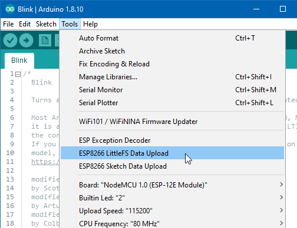

# Arduino ESP8266 FastROMFilesystem uploade

Arduino plugin which packs sketch data folder into FastROMFS filesystem image,
and uploads the image to ESP8266 flash memory.
 

## Installation
- Make sure you use one of the supported versions of Arduino IDE and have ESP8266 core installed.
- Download the tool archive from (https://github.com/earlephilhower/arduino-esp8266fastromfs-plugin).
- In your Arduino sketchbook directory, create tools directory if it doesn't exist yet.
- Unpack the tool into tools directory (the path will look like `<home_dir>/Arduino/tools/ESP8266FS/tool/esp8266fs.jar)`.
- Restart Arduino IDE. 

On the OS X create the tools directory in ~/Documents/Arduino/ and unpack the files there

## Usage
- Open a sketch (or create a new one and save it).
- Go to sketch directory (choose Sketch > Show Sketch Folder).
- Create a directory named `data` and any files you want in the file system there.
- Make sure you have selected a board, port, and closed Serial Monitor.
- Select *Tools > ESP8266 FastROMFS Data Upload* menu item. This should start uploading the files into ESP8266 flash file system.
  When done, IDE status bar will display FastROMFS Image Uploaded message. Might take a few minutes for large file system sizes.

## Screenshot

## Credits and license

- Copyright (c) 2015 Hristo Gochkov (ficeto at ficeto dot com)
- Licensed under GPL v2 ([text](LICENSE))
- Modified by Earle F. Philhower, III for FastROMFilesystem use

## Issues and suggestions

File issues here on github, or ask your questions on the [esp8266.com forum](http://esp8266.com/arduino).
